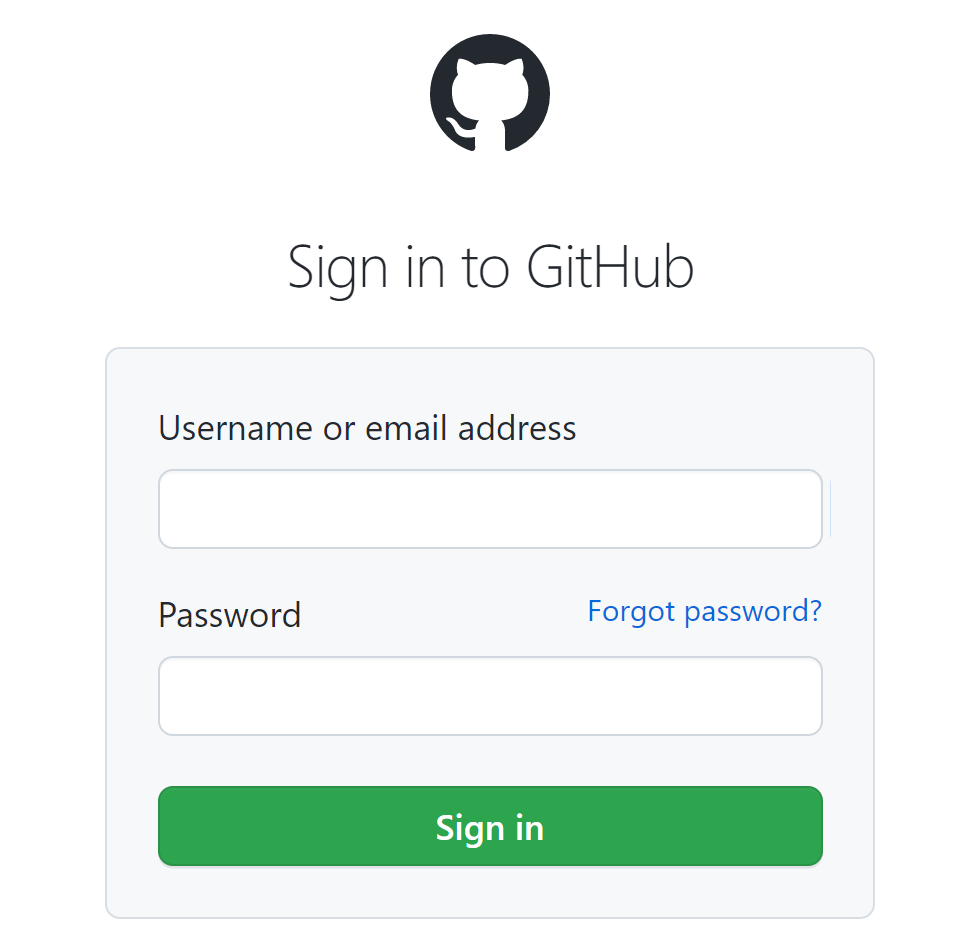
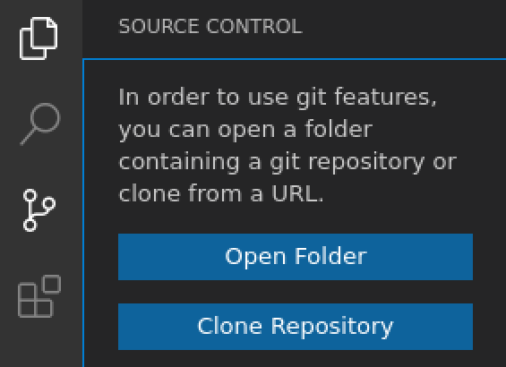
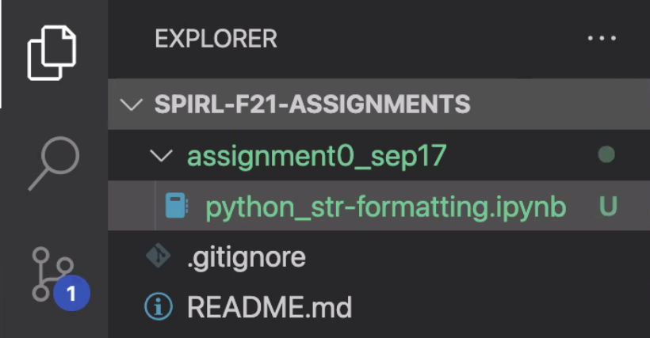
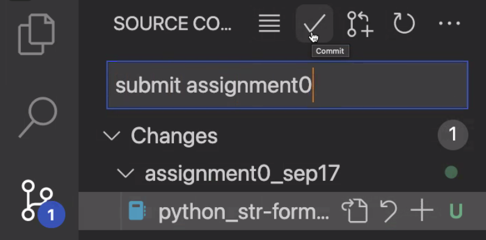
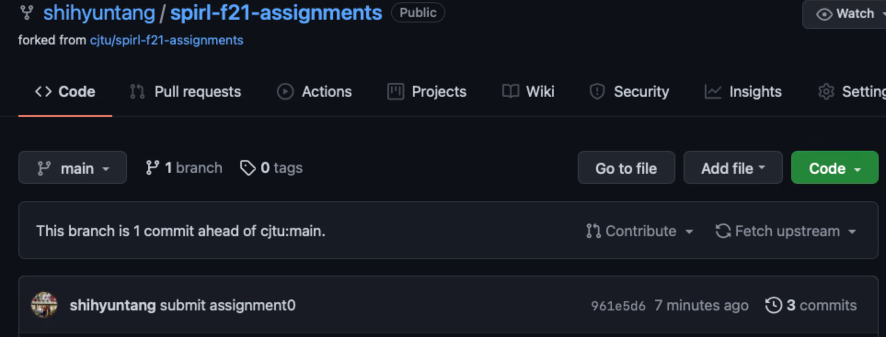
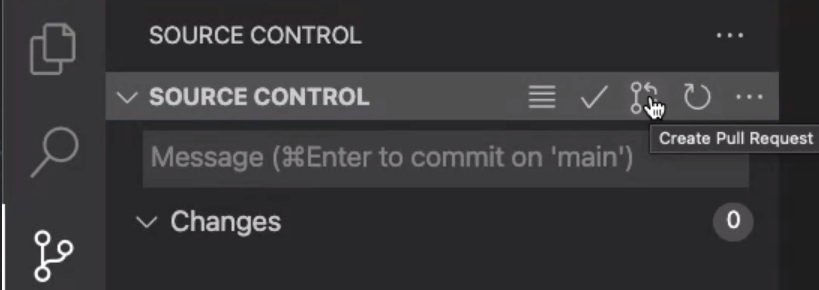
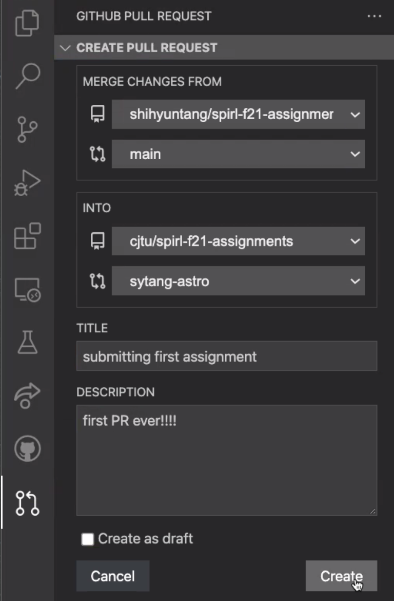
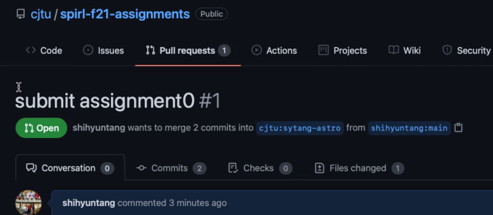

# How To Submit Assignments

All assigned work is due on GitHub by 5 PM on Friday the week it is assigned.

## First-time Setup

If you have already done the first-time setup, please skip ahead to [Submitting Assignments as Pull Requests](#submitting-assignments-as-pull-requests).

To submit assignments you will need:

- A GitHub account ([signup](https://github.com/signup))
- VS Code ([install](https://code.visualstudio.com/download))

1) Login to [GitHub.com](https://github.com/login)

2) Fork the [cjtu/spirl-f21-assignments](https://github.com/cjtu/spirl-f21-assignments) repo.

After forking you should see:

3) Start VS Code and open a new window with `Ctrl+Shift+N`.  Open the Source Control Tab (or press `Ctrl+Shift+G`).

4) Click "Clone Repository".

5) Click "Clone from GitHub" or press `Enter`.

6) Allow VS Code to connect to GitHub (you will be taken to a browser and may need to login again). For more info see [Working with GitHub in VS Code](https://code.visualstudio.com/docs/editor/github).

7) Clone the `<your-username>/spirl-f21-assignments` repository.

8) Install the GitHub Pull Requests and Issues Extension from the Extensions Tab

## Submitting Assignments as Pull Requests

When you are ready to submit your assignment, follow the steps below to submit your work to GitHub.

1) Add your assignment to the weekly folder.

2) In the Source Control tab, write a commit message and then click the checkmark (commit) button.

3) Click the 3 dots and choose "Push" to update your changes to GitHub.

You can check on GitHub if you pushed successfully by refreshing your forked repository page. You should see your newest changes reflected in the files on GitHub.

4) Back in the Source Control tab of VS Code, click the Create Pull Request button.

5) Make sure to select your username as the branch in the 4th dropdown (into section).

6) Name your pull request (e.g. "Submit Assignment 0") and leave a description if you'd like. Click "Create".

1) To check if your assignment was successfully submitted, you can check the pull requests on github at the main `cjtu/spirl-f21-assignments` repo [here](https://github.com/cjtu/spirl-f21-assignments/pulls).

8) You're done! Once your pull request appears on GitHub, your assignment is officially submitted. Nice job!

9) (optional) To fix your submission while the pull request is open simply make changes, commit and push. The pull request will be automatically updated. If the pull request is already `Merged` or `Closed`, you will need to commit and push changes and open a new pull request.

Christian or Shih-Yun will leave feedback on your pull request before the next class.
